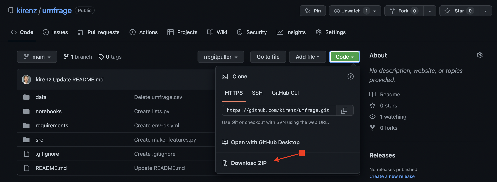
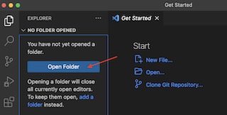

# Umfrage

---

## Download Repo

- Speichern Sie dieses Repository als ZIP-Datei auf Ihrem Rechner:
  - Klicken Sie auf den grünen Button `Code`
  - Wählen Sie die Option "Download ZIP"
  

---

## Visual Studio Code

- Entpacken Sie die Datei in einen Ordner Ihrer Wahl.

- Öffnen Sie Visual Studio Code und wählen Sie oben links in der Aktivitätsleiste  „Explorer“ aus. Navigieren Sie zu dem blauen Menüpunkt "Open Folder" und wählen Sie den Ordner "umfrage" aus. Dieser Ordner ist nun Ihr Projektverzeichnis.

